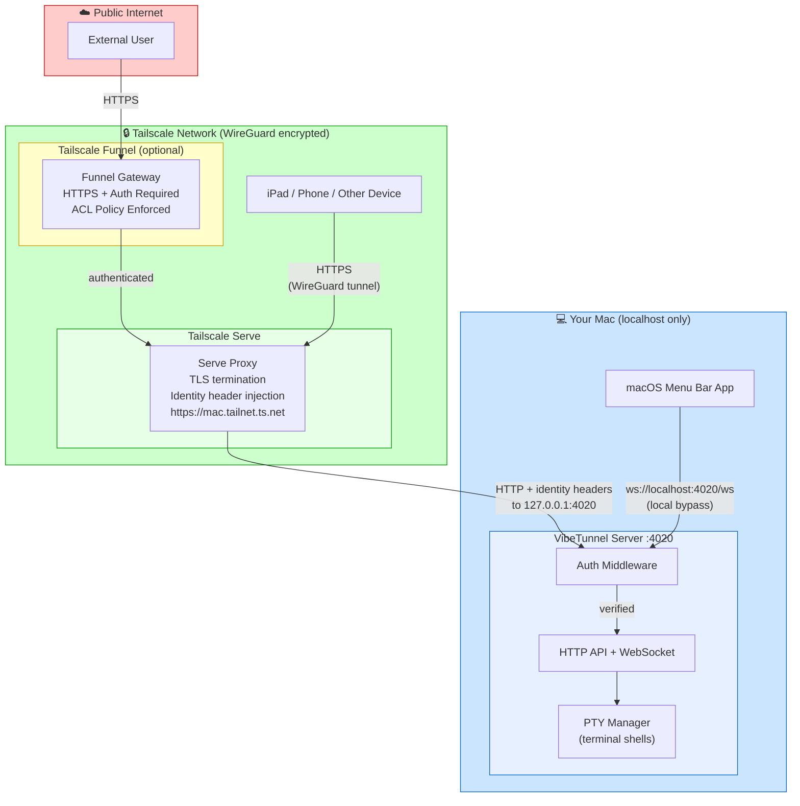
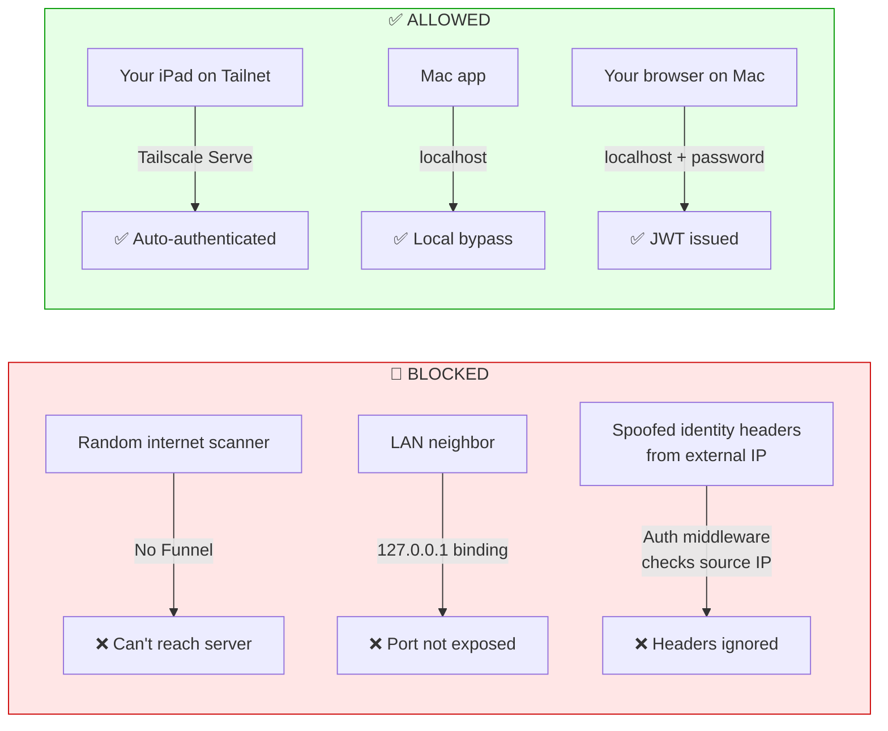
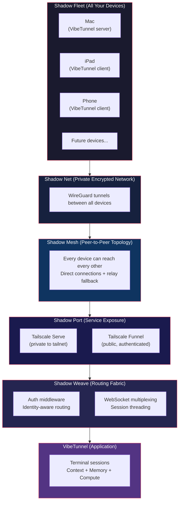

# VibeTunnel Network Security Architecture

A visual guide to understanding how VibeTunnel's network layers, security boundaries, and Tailscale integration work together.

---

## Shadow Labs Vision: The Ambient Computing Stack

VibeTunnel is one product within **Shadow Labs** — a broader vision for **ambient personal intelligence**. The idea: your computing environment is always with you but invisible, like a shadow. It narrows context to what's relevant, manages memory/data/compute across all your devices, and disappears when you don't need it.

The current stack uses Tailscale as the networking foundation. Over time, each layer will be replaced by purpose-built Shadow technologies with different underlying protocols:

```
┌─────────────────────────────────────────────────────────────────────────┐
│                    SHADOW LABS TECHNOLOGY STACK                          │
│                 "Ambient Computing for Personal Intelligence"            │
│                                                                         │
│  ┌─────────────────────────────────────────────────────────────────┐   │
│  │  SHADOW FLEET                                                    │   │
│  │  Device orchestration & management                               │   │
│  │  All your devices, unified as one compute surface                │   │
│  │  (Currently: Tailscale device enrollment)                        │   │
│  │                                                                  │   │
│  │  ┌──────────────────────────────────────────────────────────┐   │   │
│  │  │  SHADOW NET                                               │   │   │
│  │  │  The private network connecting your fleet                │   │   │
│  │  │  Always on, zero-config, encrypted by default             │   │   │
│  │  │  (Currently: Tailscale tailnet / WireGuard)               │   │   │
│  │  │                                                           │   │   │
│  │  │  ┌───────────────────────────────────────────────────┐   │   │   │
│  │  │  │  SHADOW MESH                                       │   │   │   │
│  │  │  │  Peer-to-peer interconnection topology              │   │   │   │
│  │  │  │  Every device can reach every other device          │   │   │   │
│  │  │  │  (Currently: Tailscale mesh / DERP relays)          │   │   │   │
│  │  │  │                                                     │   │   │   │
│  │  │  │  ┌──────────────────────────────────────────────┐  │   │   │   │
│  │  │  │  │  SHADOW PORT                                  │  │   │   │   │
│  │  │  │  │  Transport protocol for service exposure      │  │   │   │   │
│  │  │  │  │  Secure tunneling with identity-aware routing │  │   │   │   │
│  │  │  │  │  (Currently: Tailscale Serve/Funnel)          │  │   │   │   │
│  │  │  │  │                                               │  │   │   │   │
│  │  │  │  │  ┌───────────────────────────────────────┐   │  │   │   │   │
│  │  │  │  │  │  SHADOW WEAVE / SHADOW LOOM            │   │  │   │   │   │
│  │  │  │  │  │  Threading & routing fabric             │   │  │   │   │   │
│  │  │  │  │  │  Context-aware request routing          │   │  │   │   │   │
│  │  │  │  │  │  Data/memory/compute distribution       │   │  │   │   │   │
│  │  │  │  │  │  The "intelligence" layer that makes    │   │  │   │   │   │
│  │  │  │  │  │  the shadow follow you                  │   │  │   │   │   │
│  │  │  │  │  └───────────────────────────────────────┘   │  │   │   │   │
│  │  │  │  └──────────────────────────────────────────────┘  │   │   │   │
│  │  │  └───────────────────────────────────────────────────┘   │   │   │
│  │  └──────────────────────────────────────────────────────────┘   │   │
│  └─────────────────────────────────────────────────────────────────┘   │
│                                                                         │
│  APPLICATIONS: VibeTunnel, [future Shadow products...]                  │
└─────────────────────────────────────────────────────────────────────────┘
```

### Shadow ↔ Tailscale Mapping (Current → Future)

| Shadow Layer | Role | Current Implementation | Future (Shadow Protocol) |
|---|---|---|---|
| **Shadow Fleet** | Device enrollment & orchestration | Tailscale admin console + device auth | Custom fleet management with context-aware scheduling |
| **Shadow Scale** | Fleet scaling & identity | Tailscale coordination server | Decentralized identity + self-organizing fleet |
| **Shadow Net** | Private encrypted network | Tailscale tailnet (WireGuard) | Custom encrypted overlay network |
| **Shadow Mesh** | Peer-to-peer topology | Tailscale mesh + DERP relay servers | Direct mesh with intelligent relay selection |
| **Shadow Port** | Service exposure & tunneling | Tailscale Serve (private) + Funnel (public) | Identity-aware port forwarding with context narrowing |
| **Shadow Weave** | Request routing fabric | HTTP routing + auth middleware | Context-aware routing that follows the user |
| **Shadow Loom** | Thread orchestration | WebSocket multiplexing | Distributed compute threading across fleet |

### The Shadow Metaphor in Practice

```
  "Casting Shadow" = Narrowing context to what's relevant

  You're on your Mac working in a terminal session:

    ┌─ Shadow knows ──────────────────────────────────────┐
    │  • Which sessions are active                         │
    │  • Which device you're on                            │
    │  • What context/project you're in                    │
    │  • Your authentication identity                      │
    └──────────────────────────────────────────────────────┘

  You pick up your iPad:

    ┌─ Shadow follows ─────────────────────────────────────┐
    │  • Same sessions, instantly available                  │
    │  • Identity travels with you (Shadow Fleet)           │
    │  • Encrypted path auto-established (Shadow Mesh)      │
    │  • Context preserved across devices (Shadow Weave)    │
    │  • No setup, no login, no URL to remember             │
    │  • It's just... there. Like a shadow.                 │
    └──────────────────────────────────────────────────────┘
```

---

## Current Implementation: Tailscale Security Layers

The diagrams below show how VibeTunnel works **today** using Tailscale as the Shadow Net foundation.

## The Big Picture

```
┌─────────────────────────────────────────────────────────────────────────────┐
│                        PUBLIC INTERNET                                       │
│                    (untrusted, anyone can reach)                             │
│                                                                             │
│   ┌──────────┐                                                              │
│   │ Attacker │ ──── BLOCKED ────┐                                           │
│   └──────────┘                  │                                           │
│                                 ▼                                           │
│   ┌──────────────────────────────────────────────────────┐                  │
│   │              TAILSCALE FUNNEL GATEWAY                │                  │
│   │           (only enabled if you turn it on)           │                  │
│   │                                                      │                  │
│   │  ✓ HTTPS only (TLS termination)                     │                  │
│   │  ✓ Tailscale authentication required                │                  │
│   │  ✓ ACL policies enforced                            │                  │
│   │  ✗ Anonymous access impossible                      │                  │
│   └──────────────────────┬───────────────────────────────┘                  │
│                          │ (authenticated traffic only)                     │
└──────────────────────────┼──────────────────────────────────────────────────┘
                           │
┌──────────────────────────┼──────────────────────────────────────────────────┐
│                     TAILSCALE NETWORK (tailnet)                             │
│              (encrypted WireGuard mesh, private to you)                     │
│                                                                             │
│   ┌────────────┐    ┌────────────┐    ┌────────────┐                       │
│   │  Your Mac  │    │ Your iPad  │    │ Your Phone │                       │
│   │  (server)  │    │ (browser)  │    │  (browser) │                       │
│   └─────┬──────┘    └─────┬──────┘    └──────┬─────┘                       │
│         │                 │                   │                              │
│         │    All traffic encrypted end-to-end (WireGuard)                   │
│         │    Each device has unique identity + keys                          │
│         │                 │                   │                              │
│         │                 ▼                   ▼                              │
│         │          ┌─────────────────────────────────┐                      │
│         │          │    TAILSCALE SERVE PROXY        │                      │
│         │          │  https://mac.tailnet.ts.net     │                      │
│         │          │                                 │                      │
│         │          │  ✓ TLS/HTTPS termination        │                      │
│         │          │  ✓ Injects identity headers:    │                      │
│         │          │    - tailscale-user-login        │                      │
│         │          │    - tailscale-user-name         │                      │
│         │          │    - tailscale-user-profile-pic  │                      │
│         │          │  ✓ Only forwards to localhost    │                      │
│         │          └──────────────┬──────────────────┘                      │
│         │                        │                                          │
└─────────┼────────────────────────┼──────────────────────────────────────────┘
          │                        │
┌─────────┼────────────────────────┼──────────────────────────────────────────┐
│         │   YOUR MAC (localhost) │                                           │
│         │   127.0.0.1 only       │                                           │
│         │                        │                                           │
│         │   ┌────────────────────▼────────────────────────────────┐         │
│         │   │           VIBETUNNEL SERVER (:4020)                 │         │
│         │   │           bound to 127.0.0.1                       │         │
│         │   │                                                    │         │
│         │   │  ┌──────────────────────────────────────────────┐  │         │
│         │   │  │         AUTH MIDDLEWARE (gate)                │  │         │
│         │   │  │                                              │  │         │
│         │   │  │  Request arrives → check source:             │  │         │
│         │   │  │                                              │  │         │
│         │   │  │  1. From Tailscale Serve? (localhost +       │  │         │
│         │   │  │     proxy headers) → Trust identity headers  │  │         │
│         │   │  │                                              │  │         │
│         │   │  │  2. From localhost? (no proxy headers)       │  │         │
│         │   │  │     → Local bypass (if enabled)              │  │         │
│         │   │  │     → Or require password/SSH key            │  │         │
│         │   │  │                                              │  │         │
│         │   │  │  3. Has JWT Bearer token?                    │  │         │
│         │   │  │     → Validate token, allow if valid         │  │         │
│         │   │  │                                              │  │         │
│         │   │  │  4. None of the above?                       │  │         │
│         │   │  │     → REJECTED (401 Unauthorized)            │  │         │
│         │   │  └──────────────────────────────────────────────┘  │         │
│         │   │                     │                               │         │
│         │   │                     ▼ (authenticated)               │         │
│         │   │  ┌──────────────────────────────────────────────┐  │         │
│         │   │  │              APPLICATION LAYER               │  │         │
│         │   │  │                                              │  │         │
│         │   │  │  HTTP API: /api/sessions, /api/auth, etc.   │  │         │
│         │   │  │  WebSocket: /ws (terminal I/O, binary)      │  │         │
│         │   │  │  PTY Manager: spawns real terminal shells    │  │         │
│         │   │  └──────────────────────────────────────────────┘  │         │
│         │   └────────────────────────────────────────────────────┘         │
│         │                                                                   │
│   ┌─────▼──────────────────────────────────────────────────────────┐       │
│   │              MACOS APP (Swift/SwiftUI)                          │       │
│   │  - Spawns & manages VibeTunnel server process                  │       │
│   │  - Connects via ws://localhost:4020/ws                         │       │
│   │  - Manages Tailscale Serve lifecycle                           │       │
│   │  - Controls via Unix socket ~/Library/Caches/vibetunnel/api.sock│      │
│   └────────────────────────────────────────────────────────────────┘       │
│                                                                             │
└─────────────────────────────────────────────────────────────────────────────┘
```

## Security Layers Explained

### Layer 1: Network Boundary (What can even reach the server?)

```
                     WHO CAN CONNECT?
                     ─────────────────

  With --enable-tailscale-serve (RECOMMENDED):
  ┌──────────────────────────────────────────────────┐
  │  Server binds to 127.0.0.1 ONLY                  │
  │                                                    │
  │  ✗ Direct access from other machines? IMPOSSIBLE   │
  │  ✗ Access via your Mac's IP?          IMPOSSIBLE   │
  │  ✗ Port scan finds it?                NO           │
  │                                                    │
  │  ✓ Tailscale Serve proxy → localhost?  YES         │
  │  ✓ Mac app → localhost?                YES         │
  │  ✓ Local scripts → localhost?          YES         │
  └──────────────────────────────────────────────────┘

  Without Tailscale Serve (default 0.0.0.0):
  ┌──────────────────────────────────────────────────┐
  │  Server binds to 0.0.0.0 (ALL interfaces)        │
  │                                                    │
  │  ⚠ Anyone on your local network CAN reach :4020   │
  │  ⚠ Depends entirely on auth layer for security    │
  │  → Use --bind 127.0.0.1 to restrict manually      │
  └──────────────────────────────────────────────────┘
```

### Layer 2: Transport Encryption (Is the traffic encrypted?)

```
  ┌────────────────────────────────────────────────────────────┐
  │                  ENCRYPTION STATUS                          │
  │                                                            │
  │  iPad ──── Tailscale (WireGuard) ──── Mac                 │
  │            ✓ ENCRYPTED end-to-end                          │
  │            ✓ TLS on top via Tailscale Serve                │
  │            ✓ Double encrypted (WireGuard + TLS)            │
  │                                                            │
  │  Mac app ──── localhost ──── VibeTunnel server             │
  │               ✗ NOT encrypted (plain HTTP)                 │
  │               ✓ But it never leaves your machine           │
  │               ✓ localhost traffic can't be intercepted     │
  │                  by other machines on the network           │
  │                                                            │
  │  Browser (same Mac) ──── localhost ──── VibeTunnel server  │
  │               ✗ NOT encrypted (plain HTTP)                 │
  │               ✓ Same machine, no network exposure          │
  └────────────────────────────────────────────────────────────┘
```

### Layer 3: Authentication (Who are you?)

```
  ┌────────────────────────────────────────────────────────────────┐
  │                                                                │
  │  VIA TAILSCALE SERVE:                                          │
  │  ┌──────────────────────────────────────────────────────────┐  │
  │  │  Tailscale already knows who you are (device identity)   │  │
  │  │  → Serve proxy injects: tailscale-user-login header      │  │
  │  │  → Server trusts this ONLY from localhost + proxy combo  │  │
  │  │  → No password needed! Seamless SSO experience           │  │
  │  │  → You see your Tailscale profile pic on the dashboard   │  │
  │  └──────────────────────────────────────────────────────────┘  │
  │                                                                │
  │  VIA DIRECT ACCESS (localhost or LAN):                         │
  │  ┌──────────────────────────────────────────────────────────┐  │
  │  │  Option A: System password (macOS account password)      │  │
  │  │  Option B: SSH key challenge-response (Ed25519)          │  │
  │  │  Option C: Local bypass (for scripts on same machine)    │  │
  │  │  Option D: No auth (--no-auth, development only!)        │  │
  │  │                                                          │  │
  │  │  → Successful auth → JWT token (24h expiry)              │  │
  │  │  → Token used for all subsequent HTTP & WebSocket calls  │  │
  │  └──────────────────────────────────────────────────────────┘  │
  │                                                                │
  └────────────────────────────────────────────────────────────────┘
```

### Layer 4: Authorization (What can you do?)

```
  ┌──────────────────────────────────────────────────────┐
  │  Once authenticated, you get a terminal shell as     │
  │  the system user you logged in as.                   │
  │                                                      │
  │  ┌────────────────────────────────────────────────┐  │
  │  │  Authenticated user                            │  │
  │  │       │                                        │  │
  │  │       ├── Create terminal sessions             │  │
  │  │       ├── Send input to terminals              │  │
  │  │       ├── Receive terminal output              │  │
  │  │       ├── Resize terminals                     │  │
  │  │       └── Kill terminal sessions               │  │
  │  │                                                │  │
  │  │  The shell runs with YOUR user's permissions   │  │
  │  │  (same as if you opened Terminal.app)           │  │
  │  └────────────────────────────────────────────────┘  │
  └──────────────────────────────────────────────────────┘
```

## Mermaid Diagram: Request Flow



## Mermaid Diagram: What Gets Blocked Where



## Common Scenario: "I access VibeTunnel from my iPad"

Here's exactly what happens, step by step:

```
1. Your iPad opens https://mac-name.tailnet.ts.net
        │
        ▼
2. iPad's Tailscale client encrypts the request
   using WireGuard and routes it through the
   Tailscale coordination server to find your Mac
        │
        ▼
3. Your Mac's Tailscale client decrypts the
   WireGuard packet. Traffic arrives at
   Tailscale Serve (running locally).
        │
        ▼
4. Tailscale Serve:
   a) Terminates TLS (HTTPS → HTTP)
   b) Looks up WHO sent this request
      (your iPad's Tailscale identity)
   c) Adds headers:
      tailscale-user-login: you@gmail.com
      tailscale-user-name: Your Name
   d) Forwards to http://127.0.0.1:4020
        │
        ▼
5. VibeTunnel Auth Middleware:
   a) Sees request from 127.0.0.1 ✓
   b) Sees proxy headers present ✓
   c) Sees tailscale-user-login header ✓
   d) Trusts identity → authenticated!
        │
        ▼
6. You see the VibeTunnel dashboard with
   your Tailscale profile picture.
   WebSocket connects for live terminal I/O.
```

## What CANNOT pass through each boundary

| Boundary | What's blocked | Why |
|----------|---------------|-----|
| **Tailscale Network** | Any device not in your tailnet | WireGuard requires cryptographic identity; no key = no connection |
| **Tailscale Funnel** | Unauthenticated public users | Funnel requires Tailscale login; anonymous requests rejected |
| **Tailscale ACLs** | Unauthorized tailnet members | Admin-defined policies control which devices/users can reach which services |
| **Tailscale Serve** | Direct port access from network | Server bound to 127.0.0.1; Serve is the only path in from outside |
| **Auth Middleware** | Spoofed identity headers | Headers only trusted when request comes from localhost WITH proxy indicators |
| **Auth Middleware** | Requests without valid credentials | No token, no password, no SSH key = 401 Unauthorized |
| **PTY Sandbox** | Cross-user terminal access | Shells run as the authenticated user with that user's OS permissions |

## Quick Security Checklist

```
✅ Using --enable-tailscale-serve?
   → Server auto-binds to 127.0.0.1 (safe)
   → HTTPS handled by Tailscale (safe)
   → Identity from Tailscale headers (safe)

⚠️  Using Tailscale Funnel?
   → Public internet can reach your server
   → But ONLY authenticated Tailscale users
   → Review your ACL policies in Tailscale admin

❌ Using --no-auth?
   → Anyone who can reach the port gets a shell
   → ONLY use for local development

❌ Bound to 0.0.0.0 without Tailscale?
   → Your entire LAN can reach port 4020
   → Use --bind 127.0.0.1 or enable Tailscale Serve
```

---

## Where VibeTunnel Sits in the Shadow Stack



### The Key Insight

The entire Shadow stack exists so that **applications like VibeTunnel don't need to think about networking at all**. VibeTunnel just binds to localhost and serves terminals. Shadow Fleet/Net/Mesh/Port/Weave handle everything else:

- **Who can connect?** Shadow Fleet (device identity)
- **How do they connect?** Shadow Net + Shadow Mesh (encrypted paths)
- **Where do they connect?** Shadow Port (service discovery & exposure)
- **How is traffic routed?** Shadow Weave (context-aware threading)
- **What do they see?** Shadow Loom (the right context, on the right device, at the right time)

The application layer stays simple. The shadow does the work.
