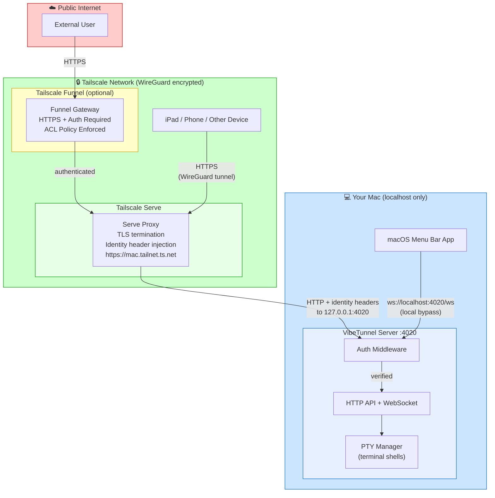
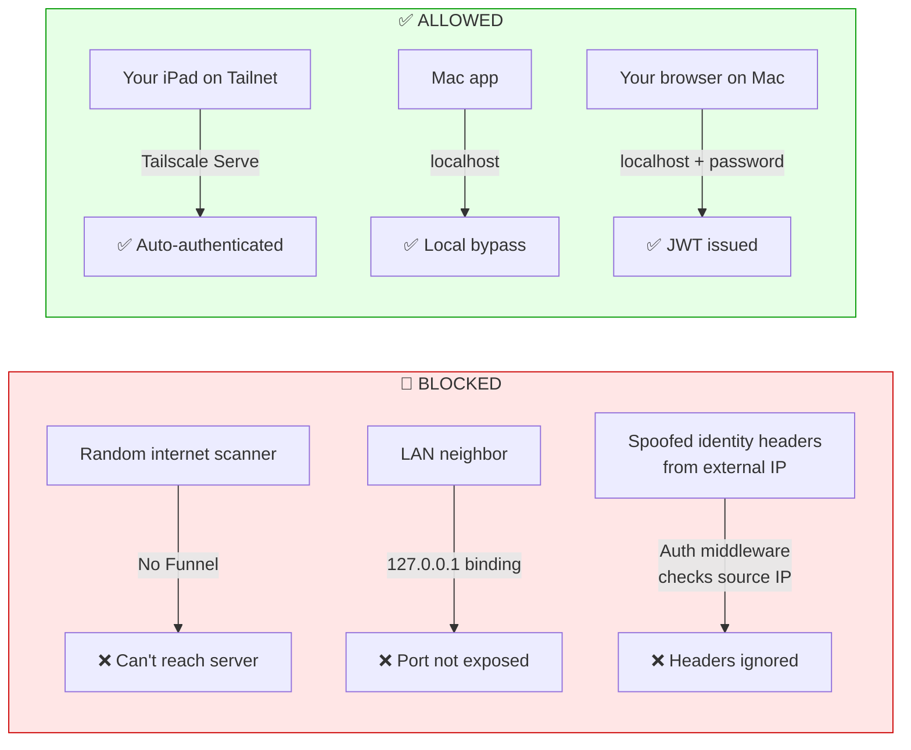
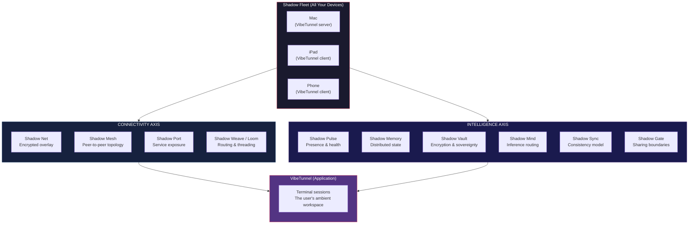

# VibeTunnel Network Security Architecture

A visual guide to understanding how VibeTunnel's network layers, security boundaries, and Tailscale integration work together.

---

## Shadow Labs Vision: The Ambient Computing Stack

VibeTunnel is one product within **Shadow Labs** — a broader vision for **ambient personal intelligence**. The idea: your computing environment is always with you but invisible, like a shadow. It narrows context to what's relevant, manages memory/data/compute across all your devices, and disappears when you don't need it.

The current stack uses Tailscale as the networking foundation. Over time, each layer will be replaced by purpose-built Shadow technologies with different underlying protocols:

```
┌─────────────────────────────────────────────────────────────────────────┐
│                    SHADOW LABS TECHNOLOGY STACK                          │
│                 "Ambient Computing for Personal Intelligence"            │
│                                                                         │
│  ┌─────────────────────────────────────────────────────────────────┐   │
│  │  SHADOW FLEET                                                    │   │
│  │  Device orchestration & management                               │   │
│  │  All your devices, unified as one compute surface                │   │
│  │  (Currently: Tailscale device enrollment)                        │   │
│  │                                                                  │   │
│  │  ┌──────────────────────────────────────────────────────────┐   │   │
│  │  │  SHADOW NET                                               │   │   │
│  │  │  The private network connecting your fleet                │   │   │
│  │  │  Always on, zero-config, encrypted by default             │   │   │
│  │  │  (Currently: Tailscale tailnet / WireGuard)               │   │   │
│  │  │                                                           │   │   │
│  │  │  ┌───────────────────────────────────────────────────┐   │   │   │
│  │  │  │  SHADOW MESH                                       │   │   │   │
│  │  │  │  Peer-to-peer interconnection topology              │   │   │   │
│  │  │  │  Every device can reach every other device          │   │   │   │
│  │  │  │  (Currently: Tailscale mesh / DERP relays)          │   │   │   │
│  │  │  │                                                     │   │   │   │
│  │  │  │  ┌──────────────────────────────────────────────┐  │   │   │   │
│  │  │  │  │  SHADOW PORT                                  │  │   │   │   │
│  │  │  │  │  Transport protocol for service exposure      │  │   │   │   │
│  │  │  │  │  Secure tunneling with identity-aware routing │  │   │   │   │
│  │  │  │  │  (Currently: Tailscale Serve/Funnel)          │  │   │   │   │
│  │  │  │  │                                               │  │   │   │   │
│  │  │  │  │  ┌───────────────────────────────────────┐   │  │   │   │   │
│  │  │  │  │  │  SHADOW WEAVE / SHADOW LOOM            │   │  │   │   │   │
│  │  │  │  │  │  Threading & routing fabric             │   │  │   │   │   │
│  │  │  │  │  │  Context-aware request routing          │   │  │   │   │   │
│  │  │  │  │  │  Data/memory/compute distribution       │   │  │   │   │   │
│  │  │  │  │  │  The "intelligence" layer that makes    │   │  │   │   │   │
│  │  │  │  │  │  the shadow follow you                  │   │  │   │   │   │
│  │  │  │  │  └───────────────────────────────────────┘   │  │   │   │   │
│  │  │  │  └──────────────────────────────────────────────┘  │   │   │   │
│  │  │  └───────────────────────────────────────────────────┘   │   │   │
│  │  └──────────────────────────────────────────────────────────┘   │   │
│  └─────────────────────────────────────────────────────────────────┘   │
│                                                                         │
│  APPLICATIONS: VibeTunnel, [future Shadow products...]                  │
└─────────────────────────────────────────────────────────────────────────┘
```

### Multi-Dimensional Architecture Analysis

The Shadow stack has **two axes** that need distinct layers. The original design is strong on the **connectivity axis** but thin on the **intelligence axis**. Both are required for ambient personal intelligence to work.

```
  CONNECTIVITY AXIS (how devices talk)     INTELLIGENCE AXIS (how data/compute lives)
  ─────────────────────────────────────    ──────────────────────────────────────────

  Shadow Fleet ── device enrollment         Shadow Memory ── distributed state/recall
  Shadow Net ──── encrypted overlay         Shadow Vault ── data sovereignty & crypto
  Shadow Mesh ─── peer topology             Shadow Mind ─── inference & reasoning
  Shadow Port ─── service exposure          Shadow Sync ── consistency & conflict resolution
  Shadow Weave ── request routing           Shadow Pulse ── presence & health
  Shadow Loom ─── thread orchestration      Shadow Gate ── sharing & access boundaries
```

Without both axes, you get a well-connected mesh with nothing meaningful flowing through it — or rich intelligence with no way to distribute it.

#### The Connectivity Axis (What You Have)

This is well-defined. The layers map cleanly from Tailscale today to custom Shadow protocols tomorrow:

| Shadow Layer | Role | Current (Tailscale) | Future (Shadow Protocol) |
|---|---|---|---|
| **Shadow Fleet** | Device enrollment & orchestration | Tailscale admin console + device auth | Custom fleet management with context-aware scheduling |
| **Shadow Scale** | Fleet scaling & identity | Tailscale coordination server | Decentralized identity + self-organizing fleet |
| **Shadow Net** | Private encrypted network | Tailscale tailnet (WireGuard) | Custom encrypted overlay network |
| **Shadow Mesh** | Peer-to-peer topology | Tailscale mesh + DERP relays | Direct mesh with intelligent relay selection |
| **Shadow Port** | Service exposure & tunneling | Tailscale Serve + Funnel | Identity-aware port forwarding with context narrowing |
| **Shadow Weave** | Request routing fabric | HTTP routing + auth middleware | Context-aware routing that follows the user |
| **Shadow Loom** | Thread orchestration | WebSocket multiplexing | Distributed compute threading across fleet |

#### The Intelligence Axis (What's Missing)

These layers handle **state, reasoning, consistency, and trust** — the dimensions that make this "personal intelligence" rather than just "personal networking":

| Shadow Layer | Role | Why It's Needed | Freenet Parallel |
|---|---|---|---|
| **Shadow Memory** | Distributed state & recall | Your terminal history, AI conversations, clipboard, context — must persist across devices and survive any single device going offline. Not just "sync" — it's the system's recall of what you were doing, where, and why. | Freenet's distributed data store (encrypted, redundant, device-local-first) |
| **Shadow Vault** | Data sovereignty & encryption at rest | Every piece of data in Shadow Memory must be encrypted with keys YOU control. No cloud provider can read it. Selective sharing: you choose what to expose to which device or person. This is the Freenet principle that matters most. | Freenet's encrypted key-based store, where data is unreadable without the holder's key |
| **Shadow Mind** | Inference & reasoning distribution | Where does AI processing happen? Your Mac has a GPU, your iPad doesn't. Shadow Mind routes inference to the right device — or splits it across devices. The "thinking" layer of personal intelligence. | No direct Freenet parallel — this is novel |
| **Shadow Sync** | Consistency & conflict resolution | When you edit on iPad while Mac is asleep, then Mac wakes up — what happens? CRDTs? Event sourcing? Last-write-wins? This layer defines the truth model across your fleet. | Freenet's eventual consistency model for distributed content |
| **Shadow Pulse** | Presence, health & state propagation | Which devices are online? What's their capacity? Battery? Network quality? Shadow Pulse is the heartbeat of the fleet — it's how the system knows where "you" are right now and which device should be primary. | Freenet's node announcement / peer discovery |
| **Shadow Gate** | Sharing & access boundaries | When you want to share a terminal session, a file, or a context window with someone NOT in your fleet — how does trust extend? Shadow Gate controls the perimeter of your shadow: what leaks out, what stays private. Funnel is a crude version of this. | Freenet's capability-based access / key sharing |

#### How the Axes Intersect

```
                    CONNECTIVITY AXIS
                    (Shadow Fleet → Net → Mesh → Port → Weave → Loom)
                    ════════════════════════════════════════════════►

               ║  ┌──────────────────────────────────────────────────┐
  INTELLIGENCE ║  │                                                  │
     AXIS      ║  │  Shadow Pulse: "iPad is online, Mac is primary"  │
               ║  │       │                                          │
  Shadow       ║  │       ▼                                          │
  Memory       ║  │  Shadow Memory: "You were editing server.ts"     │
    ↓          ║  │       │                                          │
  Shadow       ║  │       ▼                                          │
  Vault        ║  │  Shadow Vault: decrypt context with device key   │
    ↓          ║  │       │                                          │
  Shadow       ║  │       ▼                                          │
  Mind         ║  │  Shadow Mind: "Route inference to Mac GPU"       │
    ↓          ║  │       │                                          │
  Shadow       ║  │       ▼                                          │
  Sync         ║  │  Shadow Sync: merge iPad edits + Mac state       │
    ↓          ║  │       │                                          │
  Shadow       ║  │       ▼                                          │
  Pulse        ║  │  Shadow Gate: "Share this session? → scoped key" │
    ↓          ║  │                                                  │
  Shadow       ║  └──────────────────────────────────────────────────┘
  Gate         ║
               ▼
```

Every meaningful operation flows through BOTH axes:
- **Connectivity** decides HOW to move data between devices
- **Intelligence** decides WHAT data to move, WHERE to process it, and WHO can see it

#### What Happens Without Each Layer

| Missing Layer | Consequence |
|---|---|
| No Shadow Memory | You switch devices and lose all context. Back to square one every time. |
| No Shadow Vault | Your data lives in plaintext on every device. One compromised device = everything leaked. |
| No Shadow Mind | AI only works on the device with the GPU. Your phone is a dumb terminal. |
| No Shadow Sync | Two devices edit the same thing → data loss or corruption. |
| No Shadow Pulse | System doesn't know which devices are alive. Requests go to sleeping machines. |
| No Shadow Gate | You can never share anything with anyone outside your fleet without exposing everything. |

#### Freenet Principles at Work

The Freenet DNA in this architecture shows up in three critical design decisions:

1. **Local-first, network-optional**: Data exists on YOUR devices first. The mesh is for replication and availability, not primary storage. If every device goes offline except one, that one still works fully.

2. **Encrypted by default, readable by intent**: Shadow Vault means data at rest is always encrypted. You don't "opt in" to privacy — you "opt in" to sharing. This inverts the cloud model.

3. **Content-addressed, not location-addressed**: In the future Shadow protocol, you don't ask "get file from Mac." You ask "get this context" and the mesh finds it wherever it lives. The shadow follows the content, not the device.

### The Shadow Metaphor in Practice

```
  "Casting Shadow" = Narrowing context to what's relevant

  You're on your Mac working in a terminal session:

    ┌─ Shadow knows ──────────────────────────────────────┐
    │  • Which sessions are active                         │
    │  • Which device you're on                            │
    │  • What context/project you're in                    │
    │  • Your authentication identity                      │
    └──────────────────────────────────────────────────────┘

  You pick up your iPad:

    ┌─ Shadow follows ─────────────────────────────────────┐
    │  • Same sessions, instantly available                  │
    │  • Identity travels with you (Shadow Fleet)           │
    │  • Encrypted path auto-established (Shadow Mesh)      │
    │  • Context preserved across devices (Shadow Weave)    │
    │  • No setup, no login, no URL to remember             │
    │  • It's just... there. Like a shadow.                 │
    └──────────────────────────────────────────────────────┘
```

---

## Current Implementation: Tailscale Security Layers

The diagrams below show how VibeTunnel works **today** using Tailscale as the Shadow Net foundation.

## The Big Picture

```
┌─────────────────────────────────────────────────────────────────────────────┐
│                        PUBLIC INTERNET                                       │
│                    (untrusted, anyone can reach)                             │
│                                                                             │
│   ┌──────────┐                                                              │
│   │ Attacker │ ──── BLOCKED ────┐                                           │
│   └──────────┘                  │                                           │
│                                 ▼                                           │
│   ┌──────────────────────────────────────────────────────┐                  │
│   │              TAILSCALE FUNNEL GATEWAY                │                  │
│   │           (only enabled if you turn it on)           │                  │
│   │                                                      │                  │
│   │  ✓ HTTPS only (TLS termination)                     │                  │
│   │  ✓ Tailscale authentication required                │                  │
│   │  ✓ ACL policies enforced                            │                  │
│   │  ✗ Anonymous access impossible                      │                  │
│   └──────────────────────┬───────────────────────────────┘                  │
│                          │ (authenticated traffic only)                     │
└──────────────────────────┼──────────────────────────────────────────────────┘
                           │
┌──────────────────────────┼──────────────────────────────────────────────────┐
│                     TAILSCALE NETWORK (tailnet)                             │
│              (encrypted WireGuard mesh, private to you)                     │
│                                                                             │
│   ┌────────────┐    ┌────────────┐    ┌────────────┐                       │
│   │  Your Mac  │    │ Your iPad  │    │ Your Phone │                       │
│   │  (server)  │    │ (browser)  │    │  (browser) │                       │
│   └─────┬──────┘    └─────┬──────┘    └──────┬─────┘                       │
│         │                 │                   │                              │
│         │    All traffic encrypted end-to-end (WireGuard)                   │
│         │    Each device has unique identity + keys                          │
│         │                 │                   │                              │
│         │                 ▼                   ▼                              │
│         │          ┌─────────────────────────────────┐                      │
│         │          │    TAILSCALE SERVE PROXY        │                      │
│         │          │  https://mac.tailnet.ts.net     │                      │
│         │          │                                 │                      │
│         │          │  ✓ TLS/HTTPS termination        │                      │
│         │          │  ✓ Injects identity headers:    │                      │
│         │          │    - tailscale-user-login        │                      │
│         │          │    - tailscale-user-name         │                      │
│         │          │    - tailscale-user-profile-pic  │                      │
│         │          │  ✓ Only forwards to localhost    │                      │
│         │          └──────────────┬──────────────────┘                      │
│         │                        │                                          │
└─────────┼────────────────────────┼──────────────────────────────────────────┘
          │                        │
┌─────────┼────────────────────────┼──────────────────────────────────────────┐
│         │   YOUR MAC (localhost) │                                           │
│         │   127.0.0.1 only       │                                           │
│         │                        │                                           │
│         │   ┌────────────────────▼────────────────────────────────┐         │
│         │   │           VIBETUNNEL SERVER (:4020)                 │         │
│         │   │           bound to 127.0.0.1                       │         │
│         │   │                                                    │         │
│         │   │  ┌──────────────────────────────────────────────┐  │         │
│         │   │  │         AUTH MIDDLEWARE (gate)                │  │         │
│         │   │  │                                              │  │         │
│         │   │  │  Request arrives → check source:             │  │         │
│         │   │  │                                              │  │         │
│         │   │  │  1. From Tailscale Serve? (localhost +       │  │         │
│         │   │  │     proxy headers) → Trust identity headers  │  │         │
│         │   │  │                                              │  │         │
│         │   │  │  2. From localhost? (no proxy headers)       │  │         │
│         │   │  │     → Local bypass (if enabled)              │  │         │
│         │   │  │     → Or require password/SSH key            │  │         │
│         │   │  │                                              │  │         │
│         │   │  │  3. Has JWT Bearer token?                    │  │         │
│         │   │  │     → Validate token, allow if valid         │  │         │
│         │   │  │                                              │  │         │
│         │   │  │  4. None of the above?                       │  │         │
│         │   │  │     → REJECTED (401 Unauthorized)            │  │         │
│         │   │  └──────────────────────────────────────────────┘  │         │
│         │   │                     │                               │         │
│         │   │                     ▼ (authenticated)               │         │
│         │   │  ┌──────────────────────────────────────────────┐  │         │
│         │   │  │              APPLICATION LAYER               │  │         │
│         │   │  │                                              │  │         │
│         │   │  │  HTTP API: /api/sessions, /api/auth, etc.   │  │         │
│         │   │  │  WebSocket: /ws (terminal I/O, binary)      │  │         │
│         │   │  │  PTY Manager: spawns real terminal shells    │  │         │
│         │   │  └──────────────────────────────────────────────┘  │         │
│         │   └────────────────────────────────────────────────────┘         │
│         │                                                                   │
│   ┌─────▼──────────────────────────────────────────────────────────┐       │
│   │              MACOS APP (Swift/SwiftUI)                          │       │
│   │  - Spawns & manages VibeTunnel server process                  │       │
│   │  - Connects via ws://localhost:4020/ws                         │       │
│   │  - Manages Tailscale Serve lifecycle                           │       │
│   │  - Controls via Unix socket ~/Library/Caches/vibetunnel/api.sock│      │
│   └────────────────────────────────────────────────────────────────┘       │
│                                                                             │
└─────────────────────────────────────────────────────────────────────────────┘
```

## Security Layers Explained

### Layer 1: Network Boundary (What can even reach the server?)

```
                     WHO CAN CONNECT?
                     ─────────────────

  With --enable-tailscale-serve (RECOMMENDED):
  ┌──────────────────────────────────────────────────┐
  │  Server binds to 127.0.0.1 ONLY                  │
  │                                                    │
  │  ✗ Direct access from other machines? IMPOSSIBLE   │
  │  ✗ Access via your Mac's IP?          IMPOSSIBLE   │
  │  ✗ Port scan finds it?                NO           │
  │                                                    │
  │  ✓ Tailscale Serve proxy → localhost?  YES         │
  │  ✓ Mac app → localhost?                YES         │
  │  ✓ Local scripts → localhost?          YES         │
  └──────────────────────────────────────────────────┘

  Without Tailscale Serve (default 0.0.0.0):
  ┌──────────────────────────────────────────────────┐
  │  Server binds to 0.0.0.0 (ALL interfaces)        │
  │                                                    │
  │  ⚠ Anyone on your local network CAN reach :4020   │
  │  ⚠ Depends entirely on auth layer for security    │
  │  → Use --bind 127.0.0.1 to restrict manually      │
  └──────────────────────────────────────────────────┘
```

### Layer 2: Transport Encryption (Is the traffic encrypted?)

```
  ┌────────────────────────────────────────────────────────────┐
  │                  ENCRYPTION STATUS                          │
  │                                                            │
  │  iPad ──── Tailscale (WireGuard) ──── Mac                 │
  │            ✓ ENCRYPTED end-to-end                          │
  │            ✓ TLS on top via Tailscale Serve                │
  │            ✓ Double encrypted (WireGuard + TLS)            │
  │                                                            │
  │  Mac app ──── localhost ──── VibeTunnel server             │
  │               ✗ NOT encrypted (plain HTTP)                 │
  │               ✓ But it never leaves your machine           │
  │               ✓ localhost traffic can't be intercepted     │
  │                  by other machines on the network           │
  │                                                            │
  │  Browser (same Mac) ──── localhost ──── VibeTunnel server  │
  │               ✗ NOT encrypted (plain HTTP)                 │
  │               ✓ Same machine, no network exposure          │
  └────────────────────────────────────────────────────────────┘
```

### Layer 3: Authentication (Who are you?)

```
  ┌────────────────────────────────────────────────────────────────┐
  │                                                                │
  │  VIA TAILSCALE SERVE:                                          │
  │  ┌──────────────────────────────────────────────────────────┐  │
  │  │  Tailscale already knows who you are (device identity)   │  │
  │  │  → Serve proxy injects: tailscale-user-login header      │  │
  │  │  → Server trusts this ONLY from localhost + proxy combo  │  │
  │  │  → No password needed! Seamless SSO experience           │  │
  │  │  → You see your Tailscale profile pic on the dashboard   │  │
  │  └──────────────────────────────────────────────────────────┘  │
  │                                                                │
  │  VIA DIRECT ACCESS (localhost or LAN):                         │
  │  ┌──────────────────────────────────────────────────────────┐  │
  │  │  Option A: System password (macOS account password)      │  │
  │  │  Option B: SSH key challenge-response (Ed25519)          │  │
  │  │  Option C: Local bypass (for scripts on same machine)    │  │
  │  │  Option D: No auth (--no-auth, development only!)        │  │
  │  │                                                          │  │
  │  │  → Successful auth → JWT token (24h expiry)              │  │
  │  │  → Token used for all subsequent HTTP & WebSocket calls  │  │
  │  └──────────────────────────────────────────────────────────┘  │
  │                                                                │
  └────────────────────────────────────────────────────────────────┘
```

### Layer 4: Authorization (What can you do?)

```
  ┌──────────────────────────────────────────────────────┐
  │  Once authenticated, you get a terminal shell as     │
  │  the system user you logged in as.                   │
  │                                                      │
  │  ┌────────────────────────────────────────────────┐  │
  │  │  Authenticated user                            │  │
  │  │       │                                        │  │
  │  │       ├── Create terminal sessions             │  │
  │  │       ├── Send input to terminals              │  │
  │  │       ├── Receive terminal output              │  │
  │  │       ├── Resize terminals                     │  │
  │  │       └── Kill terminal sessions               │  │
  │  │                                                │  │
  │  │  The shell runs with YOUR user's permissions   │  │
  │  │  (same as if you opened Terminal.app)           │  │
  │  └────────────────────────────────────────────────┘  │
  └──────────────────────────────────────────────────────┘
```

## Mermaid Diagram: Request Flow



## Mermaid Diagram: What Gets Blocked Where



## Common Scenario: "I access VibeTunnel from my iPad"

Here's exactly what happens, step by step:

```
1. Your iPad opens https://mac-name.tailnet.ts.net
        │
        ▼
2. iPad's Tailscale client encrypts the request
   using WireGuard and routes it through the
   Tailscale coordination server to find your Mac
        │
        ▼
3. Your Mac's Tailscale client decrypts the
   WireGuard packet. Traffic arrives at
   Tailscale Serve (running locally).
        │
        ▼
4. Tailscale Serve:
   a) Terminates TLS (HTTPS → HTTP)
   b) Looks up WHO sent this request
      (your iPad's Tailscale identity)
   c) Adds headers:
      tailscale-user-login: you@gmail.com
      tailscale-user-name: Your Name
   d) Forwards to http://127.0.0.1:4020
        │
        ▼
5. VibeTunnel Auth Middleware:
   a) Sees request from 127.0.0.1 ✓
   b) Sees proxy headers present ✓
   c) Sees tailscale-user-login header ✓
   d) Trusts identity → authenticated!
        │
        ▼
6. You see the VibeTunnel dashboard with
   your Tailscale profile picture.
   WebSocket connects for live terminal I/O.
```

## What CANNOT pass through each boundary

| Boundary | What's blocked | Why |
|----------|---------------|-----|
| **Tailscale Network** | Any device not in your tailnet | WireGuard requires cryptographic identity; no key = no connection |
| **Tailscale Funnel** | Unauthenticated public users | Funnel requires Tailscale login; anonymous requests rejected |
| **Tailscale ACLs** | Unauthorized tailnet members | Admin-defined policies control which devices/users can reach which services |
| **Tailscale Serve** | Direct port access from network | Server bound to 127.0.0.1; Serve is the only path in from outside |
| **Auth Middleware** | Spoofed identity headers | Headers only trusted when request comes from localhost WITH proxy indicators |
| **Auth Middleware** | Requests without valid credentials | No token, no password, no SSH key = 401 Unauthorized |
| **PTY Sandbox** | Cross-user terminal access | Shells run as the authenticated user with that user's OS permissions |

## Quick Security Checklist

```
✅ Using --enable-tailscale-serve?
   → Server auto-binds to 127.0.0.1 (safe)
   → HTTPS handled by Tailscale (safe)
   → Identity from Tailscale headers (safe)

⚠️  Using Tailscale Funnel?
   → Public internet can reach your server
   → But ONLY authenticated Tailscale users
   → Review your ACL policies in Tailscale admin

❌ Using --no-auth?
   → Anyone who can reach the port gets a shell
   → ONLY use for local development

❌ Bound to 0.0.0.0 without Tailscale?
   → Your entire LAN can reach port 4020
   → Use --bind 127.0.0.1 or enable Tailscale Serve
```

---

## Where VibeTunnel Sits in the Shadow Stack



### The Key Insight

The Shadow stack has two jobs:

1. **Connectivity axis**: Make every device reachable, securely, without configuration. Applications bind to localhost and the shadow handles the rest.

2. **Intelligence axis**: Make context, memory, and compute follow the user across devices. Applications don't manage state distribution — the shadow remembers, syncs, and reasons on their behalf.

VibeTunnel today uses the connectivity axis (via Tailscale). The intelligence axis is what turns it from "remote terminal access" into "your terminal is always with you."

**Who can connect?** Shadow Fleet (device identity)
**How do they connect?** Shadow Net + Shadow Mesh (encrypted paths)
**Where do they connect?** Shadow Port (service discovery & exposure)
**How is traffic routed?** Shadow Weave (context-aware threading)
**What do they remember?** Shadow Memory + Shadow Vault (encrypted, distributed, yours)
**Where do they think?** Shadow Mind (inference routed to best device)
**What do they see?** Shadow Loom (the right context, on the right device, at the right time)

The application layer stays simple. The shadow does the work.
