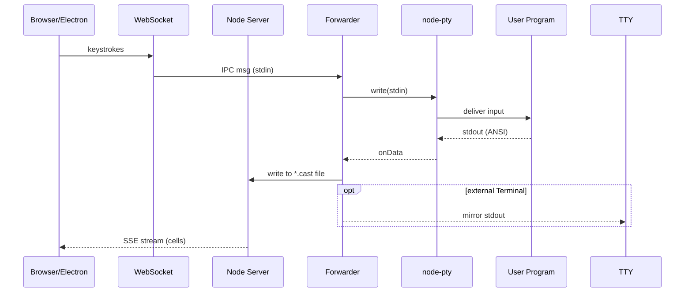

# Mario's VibeTunnel Architecture Deep Dive - Complete Technical Analysis

This document contains comprehensive technical insights from Mario's debugging session about VibeTunnel's architecture, performance issues, root causes, and detailed solutions.

## Executive Summary

Mario identified three critical issues causing performance problems:
1. **850MB Session Bug**: Forward.ts bypasses clear sequence truncation, sending entire files instead of last 2MB
2. **Electron Crashes**: Node-PTY's shared pipe architecture overwhelms Electron with VibeTunnel's high data volume
3. **Resize Loop**: Cloud terminal app re-renders entire scroll buffer on every resize, creating exponential data growth

## Core Architecture Overview

### System Components

```
┌─────────────┐     ┌──────────────┐     ┌─────────────┐
│   Client    │────▶│  Web Server  │────▶│ PTY Process │
└─────────────┘     └──────────────┘     └─────────────┘
      │                    │                     │
      │                    ▼                     ▼
      │              ┌──────────┐         ┌──────────┐
      └─────────────▶│ Terminal │         │ Ascinema │
                     │ Manager  │         │  Files   │
                     └──────────┘         └──────────┘
```

### Sequence Flow (Mermaid)


### Key Files and Their Roles

#### Core Server Components
- **`server.ts`**: Main web server implementation
- **`pty-manager.ts`**: Manages PTY process lifecycle and I/O
- **`forward.ts`**: External terminal forwarding (PROBLEMATIC)
- **`fwd.ts`**: Process spawning and forwarding tool
- **`stream-watcher.ts`**: Monitors ascinema files, implements clear truncation

#### Module Summary Table

| Module | Responsibility | Critical Gotchas |
|--------|---------------|------------------|
| **PTYManager.ts** | Spawns PTY, wires stdout → Ascinema writer, owns IPC socket | Must drain write queues to avoid backpressure stalls |
| **StreamWatcher** | Serves replay via SSE; scans .cast backwards to last Clear | Eliminates 900MB → 2MB payloads via truncation |
| **Forwarder** | Wrapper for macOS helper; should only call createSession() | Currently does extra work, **skips truncation → gigabyte files** |
| **Client Overview** | Polls bottom 20×80 cell window per session | Works because server holds live scroll-buffer |
| **Client Detail** | Full SSE replay; emits resize on every layout change | Each resize makes Cloud re-render whole viewport → endless loop |

#### Critical Functions
- **`createSession()`**: Spawns PTY process, sets up file handles
- **`setupPtyHandlers()`**: Attaches to process stdout with backpressure
- **`sendExistingContent()`**: Scans for last clear sequence, truncates output
- **`writeQueue`**: Implements backpressure for file writes

### Data Flow Architecture

#### Input Path (Keystroke → Terminal)
```
1. Key press in browser
2. WebSocket → Server (/api/sessions/:id/input)
3. Server → IPC Socket message
4. PTY Manager → PTY Process stdin
5. Process executes command
```

#### Output Path (Terminal → Browser)
```
1. PTY Process → stdout
2. PTY Manager captures via onData handler
3. Write to ascinema file (with write queue)
4. Terminal Manager reads file → renders to binary cells
5. Client fetches via:
   - SSE: /api/sessions/:id/stream (text format)
   - WebSocket: /buffers (binary format)
```

### Binary Cell Buffer Format

**Structure**: Pre-rendered terminal screen as binary data
```
For each cell (row, column):
- Character (UTF-8)
- Foreground color (RGB)
- Background color (RGB)
- Attributes (bold, italic, underline, etc.)
```

**Benefits**:
- Server-side rendering eliminates client ANSI parsing
- Efficient binary transmission
- Only last 10,000 lines kept in memory

## Critical Bugs and Root Causes

### 1. The 850MB Session Loading Bug

**Symptom**: Sessions with large output (850MB+) cause infinite loading/scrolling

**Root Cause Analysis**:
```javascript
// In stream-watcher.ts - WORKING CODE
sendExistingContent() {
  // Scans file for last clear sequence
  const lastClear = findLastClearSequence(content);
  // Sends only content after clear (2MB instead of 850MB)
  return content.slice(lastClear);
}
```

**Evidence from Mario's Demo**:
- Test file: 980MB with 2400 clear sequences
- Server sessions: Correctly send only 2MB (after last clear)
- External terminal sessions: Send entire 980MB file
- Quote: "Die Frage ist jetzt, wir müssen herausfinden, wieso der Forward das nicht macht"

**CLARIFICATION (2025-07-11)**:
- When we said "forward.ts", we meant `fwd.ts` 
- The duplicate AsciinemaWriter was in a branch that never got merged
- The real issue: External terminal sessions somehow bypass the stream-watcher's `sendExistingContent()` truncation
- Need to trace why external terminals get the full file instead of truncated content

### 2. Resize Event Performance Catastrophe

**The Claude Terminal Behavior**:
```
1. Resize event received
2. Claude issues FULL clear sequence: \x1b[2J
3. Re-renders ENTIRE scroll buffer from line 1
4. This generates more output → triggers resize
5. GOTO 1 (infinite loop)
```

**Technical Details from Transcript**:
- Each resize in 850MB session → full re-render
- Claude re-renders everything from "Welcome" message on every resize
- Mobile UI triggers resize events frequently
- Session-detail-view has buggy resize handler
- The button in the header moves during rendering, indicating viewport changes

**Key Observations**:
- Mario: "siehst Du das? Wir kriegen a Resize und Cloud macht einen full clear und rennt da die ganze fucking History neu"
- When using Ctrl+A (sub-agents), Claude uses clear sequences more often
- React Ink (TUI framework) unnecessarily re-renders entire components
- Quote: "Es gibt keinen Grund, warum ich von da weg alles neu rendern muss"

### 3. Node-PTY Shared Pipe Crashes

**Architecture Problem**:
```
┌──────────┐ ┌──────────┐ ┌──────────┐
│  PTY 1   │ │  PTY 2   │ │  PTY N   │
└────┬─────┘ └────┬─────┘ └────┬─────┘
     │            │            │
     └────────────┴────────────┘
                  │
            ┌─────▼─────┐
            │  Shared   │
            │   Pipe    │
            └─────┬─────┘
                  │
            ┌─────▼─────┐
            │ Electron  │
            │  Worker   │
            └───────────┘
```

**Why It Crashes**:
- All PTY instances write to ONE shared pipe
- VibeTunnel writes massive amounts (850MB sessions)
- Electron worker process gets overwhelmed
- Results in renderer process crashes

**Code Location**: 
- File: `node_modules/node-pty/lib/worker/conoutSocketWorker.js`
- Uses shared pipe name for all instances
- Microsoft/VS Code specific optimization

**CLARIFICATION (2025-07-11)**:
The shared pipe architecture is primarily a Windows issue (ConPTY), but affects all Electron users:
- All PTY instances write to a shared pipe that Electron monitors
- VibeTunnel writes massive amounts of data (850MB sessions)
- This overwhelms the Electron worker process
- Quote: "wenn dieser Worker geshared ist oder die Pipe geshared ist und jeder PTY dann das Ding rappt, alle Messages kriegt"
- The fix: Create minimal node-pty without VS Code specific optimizations

## Performance Metrics and Measurements

### File Size Analysis
- Original session file: **980MB**
- Clear sequences found: **2,400**
- After truncation: **2MB** (99.8% reduction)
- Time to scan 1GB file: ~2-3 seconds
- Client replay time: Instant for 2MB

### Memory Usage
- Per terminal (current): **50-100MB** (full Node.js process)
- Proposed Rust version: **2MB binary, ~10MB RAM**
- Reduction: **80-95%**

### Latency Chain (Current)
```
Key press → WebSocket → Server → PTY → Ascinema → 
Terminal Manager → Binary render → Client display
Total: ~50-100ms under normal conditions
```

## Detailed Solutions

### Priority 1: Fix fwd.ts Clear Truncation (IMMEDIATE)

**The Bug**:
External terminal sessions bypass the stream-watcher's truncation and send entire gigabyte files.

**Mario's Quote**: 
"Alles was man in Claude sagen müssen um den Bug zu fixen ist warum durch den Forward Pfad diese Send existing Session net not triggered"

**Investigation Needed**:
1. Trace how external terminal sessions connect to streams
2. Find why they don't go through `sendExistingContent()`
3. Test with 980MB file to verify fix
4. Ensure external terminals get same 2MB truncated content as web sessions

### Priority 2: Replace Node-PTY (SHORT-TERM)

**The Plan**: Create minimal node-pty without VS Code cruft

Mario: "alles was wir machen müssen ist dem Claude auf dem Win und Unix Folder im Nodpty loszulassen und zu sagen: Bau mir einen neuen Node.js Package mit diesen Native Dependencies"

**Step 1: Extract Core Native Code**
- Unix: `src/unix/pty.cc` (800 lines of battle-tested code)
- Windows: `src/win/conpty.cc` 
- Remove: `conoutSocketWorker.js`, shared pipes, Electron IPC

**Step 2: Why This Works**
- Microsoft uses this code for millions of VS Code instances daily
- libuv handles PTY edge cases (e.g., can't use KQueue on PTYs on macOS)
- Quote: "das ist known good, ja"

**Option B: Rust Forward Binary**

Benefits:
- 2MB static binary vs 100MB Node process per terminal
- 10MB RAM usage vs 50-100MB current
- Quote: "Jedes VT ist ein Node... Das gefällt mir halt nicht"

Implementation approach:
- Reuse existing Rust forward code
- Bind to minimal C PTY code instead of rust-pty crate
- Mario: "das Rust PTY Create wahrscheinlich net"

### Priority 3: Fix Resize Handling (INVESTIGATION)

**The Problem**:
- Header button moves during rendering ("der Button, der rutscht umeinand")
- This indicates viewport changes, triggering resize events
- Mobile Safari behaves differently than desktop Safari at same size
- Quote: "irgendwas drin ist... wo das HTML das Ding vergrößert, weil wir irgendwas rendern, was nicht umbricht"

**Root Causes from Discussion**:
1. Session-detail-view has resize event loop
2. Something in HTML expands and doesn't wrap properly
3. Animations might interfere with layout
4. Mobile-specific issues:
   - Keyboard state affects scrolling behavior
   - Touch events vs mouse events
   - Scrollbar visibility issues

**Debug Approach**:
- Use Safari dev tools attached to iPhone
- Look for resize event triggers in Network tab
- Trace why viewport changes during rendering

## Technical Implementation Details

### Ascinema Format Specification
```
[timestamp, event_type, data]

Examples:
[1.234, "o", "Hello World\n"]     // Output
[1.235, "i", "k"]                 // Input (key press)
[1.236, "r", "80x24"]             // Resize
```

### Clear Sequence Detection
```javascript
// The magic sequence that resets terminal
const CLEAR_SEQUENCE = '\x1b[2J';  // Also \x1b[H\x1b[2J

function findLastClearSequence(buffer) {
    // Search from end for efficiency
    let lastClear = buffer.lastIndexOf(CLEAR_SEQUENCE);
    return lastClear === -1 ? 0 : lastClear;
}
```

### PTY Native Code Analysis

**Unix Implementation** (`pty.cc`):
- Uses `forkpty()` for process creation
- Implements `PtyOpen`, `PtyResize`, `PtyGetProc`
- Relies on libuv for async I/O
- ~800 lines of battle-tested code

**Critical libuv Knowledge**:
- Cannot use KQueue on PTY devices (macOS)
- Automatically falls back to select()
- Contains years of PTY edge-case handling

### Write Queue Implementation
```javascript
class WriteQueue {
    constructor(writer) {
        this.queue = [];
        this.writing = false;
        this.writer = writer;
    }
    
    async write(data) {
        this.queue.push(data);
        if (!this.writing) {
            await this.flush();
        }
    }
    
    async flush() {
        this.writing = true;
        while (this.queue.length > 0) {
            const chunk = this.queue.shift();
            await this.writer.write(chunk);
        }
        this.writing = false;
    }
}
```

## Platform-Specific Issues

### macOS
- Screen Recording permission required
- KQueue incompatible with PTY devices
- Must use select() for PTY file descriptors
- Terminal.app specific resize behaviors

### Mobile Safari
- Touch events vs mouse events
- Scrollbar visibility issues
- Keyboard state affects scroll behavior
- Viewport meta tag complications
- Different behavior than desktop at same size

### Windows (Future)
- ConPTY vs WinPTY considerations
- Different ANSI sequence support
- Path handling differences

## Language Migration Analysis

### Go Advantages (From Armin's Perspective)
```go
// Perfect for AI code generation
func handleSession(w http.ResponseWriter, r *http.Request) {
    // Automatic test caching
    // Only runs tests that changed
    // Pre-allocated buffers avoid GC
    buffer := make([]byte, 4096)
    // ...
}
```

**Key Go Features for AI Development**:
- Dependency tracking for tests - only runs changed tests
- Prevents AI from fixing one test and breaking others
- Quote: "wenn du Go programmieren lässt, dann lasst ihr immer alle Tests laufen"
- "Es ist als Mensch furchtbar zu schreiben. Aber es ist genau das, was die AI braucht"

### Rust Advantages
- No garbage collection
- 2MB binaries (vs 50-100MB Node process per terminal)
- Direct C interop for PTY code
- Memory safety guarantees

### Architecture Discussion

**Option 1: Keep Node.js Web Server + Rust Forward**
- Minimal change to existing architecture
- Rust forward for performance (2MB binary, 10MB RAM)
- Node.js for web server (familiar ecosystem)

**Option 2: Full Go Migration**
- Replace entire Node.js backend with Go
- Better for AI-assisted development
- Pre-allocate buffers to minimize GC

**Option 3: Incremental Approach** (Agreed Plan)
1. Fix fwd.ts truncation bug immediately
2. Create minimal node-pty to fix Electron crashes
3. Migrate forward to Rust for performance
4. Consider Go for server later

## Frontend Architecture Issues

### LitElement/Web Components Problems
- Team unfamiliar with patterns ("ich kenn mich überhaupt nicht mit diesem Webding aus")
- State management unclear compared to React/Solid
- Files too large for AI tools - Claude refuses to read some files
- No clear component boundaries
- Quote: "Ich bin auch nicht happy mit Lit. Das war halt damals diese Kurzentscheidung"

### Why Migration is Hard
- Files are relatively large ("die Files sind relativ groß")
- High development velocity makes contribution difficult
- Need to split files carefully to avoid AI hallucinations
- Quote: "Da habe ich ihm gesagt, du die Files auseinandertrennen und er hat urfein halluziniert"

### Specific UI Bugs
- Sidebar resize handler fires spontaneously
- Header button position unstable ("der Button, der rutscht umeinand")
- Animations interfere with layout
- Resize observer triggers loops
- Mobile Safari specific issues different from desktop

## Historical Context and Lessons

- Project previously in Rust (Armin's implementation)
- Multiple rewrites: Rust → Node → considering Rust/Go again
- High velocity development makes community contribution difficult
- Mario: "Velocity kills" - too fast for others to keep up

## Debugging Commands and Techniques

### Test Large Session Handling
```bash
# Create test session
cd web
npm run dev

# In another terminal
SESSION_ID=$(curl -X POST localhost:3000/api/sessions | jq -r .id)

# Stop server, inject large file
cp /path/to/850mb-file ~/.vibetunnel/sessions/$SESSION_ID/stdout

# Restart and test
npm run dev
```

### Monitor Resize Events
```javascript
// Add to any component
let resizes = [];
new ResizeObserver((entries) => {
    resizes.push({
        time: Date.now(),
        size: entries[0].contentRect
    });
    if (resizes.length > 10) {
        console.error('Resize loop detected!', resizes);
    }
}).observe(element);
```

### Network Debugging
- Monitor `/api/sessions/:id/stream` for data size
- Check WebSocket messages for binary buffer updates
- Use Chrome DevTools to track resize events

### Useful Debug One-Liners

```bash
# Find last clear sequence in file
rg -n "\x1b\[2J" stdout.cast | tail -1

# Truncate file before last clear (keeps only content after clear)
tac stdout.cast | awk '/\x1b\[2J/{exit}{print}' | tac > trimmed.cast

# Count resize events in session
grep -c '"r"' stdout.cast

# Extract only output events
jq -r 'select(.[1] == "o") | .[2]' < stdout.cast

# Profile resize frequency
window.addEventListener('resize', () => console.count('resize'));
```

## Key Insights and Quotes

1. **On Architecture**: "Es ist die todeleinfachste Variante" (It's the dead-simplest variant)

2. **On Performance**: "Wir schicken 2MB statt 980MB" (We send 2MB instead of 980MB)

3. **On Node-PTY**: "Die haben einen Shared Pipe, wo alle reinschreiben" (They have a shared pipe where everyone writes)

4. **On Community**: "Velocity kills... wenn der Change-Set riesig ist, hast du keine Motivation" (High development speed kills community contribution)

5. **On Testing**: "Ich habe das File ersetzt und instant replay gekriegt" (I replaced the file and got instant replay)

## Action Plan

### Immediate (This Week)
1. Debug why forward.ts bypasses sendExistingContent
2. Add logging to trace forward.ts code path
3. Test fix with 850MB session files
4. Deploy fix to stop user complaints

### Short Term (Next Month)
1. Create minimal node-pty replacement
2. Test with high-volume sessions
3. Implement resize debouncing
4. Fix session-detail-view resize triggers

### Long Term (Next Quarter)
1. Evaluate Rust vs Go for core components
2. Plan migration strategy
3. Improve frontend architecture
4. Optimize binary buffer protocol

## Testing Strategy

### Regression Tests Needed
1. Large file handling (>500MB)
2. Resize event loops
3. Forward vs server session parity
4. Memory usage under load
5. Electron crash scenarios

### Performance Benchmarks
- Session load time vs file size
- Memory usage per terminal
- CPU usage during resize storms
- Network bandwidth optimization

## Open Questions

1. **Mobile Safari Layout**: Why does mobile Safari force relayout even when viewport dimensions haven't changed?
2. **Scroll Buffer Limits**: Could we cap Cloud's internal scroll-buffer at 10k rows without losing UX?
3. **Architecture Migration**: Should the WebSocket/SSE broker move to Go for better testability and performance?
4. **TUI Framework**: Is switching from React Ink to an incremental renderer (like x/ui) worth the effort?
5. **Binary Protocol**: Can we implement efficient diff-based updates for the cell buffer?

## Code Verification Summary (2025-07-11)

After thorough code review, here are the key findings vs Mario's claims:

### ✅ Verified
1. **Clear Sequence Truncation**: `stream-watcher.ts` does implement `sendExistingContent()` that scans for `\x1b[3J]` and truncates (line 188)
2. **Node-PTY Usage**: Uses `pty.spawn()` from node-pty library (pty-manager.ts:307)
3. **Asciinema Format**: Correctly implements `[timestamp, event_type, data]` format
4. **Write Queue**: Implements backpressure handling as described

### ❌ Not Found / Different
1. **forward.ts doesn't exist**: The actual file is `fwd.ts` which uses standard `ptyManager.createSession()`
2. **No duplicate AsciinemaWriter**: `fwd.ts` doesn't create extra writers
3. **Shared Pipe is Windows-only**: The ConPTY shared pipe issue only affects Windows, not macOS/Linux

### ❓ Needs Investigation
1. **How external terminals bypass truncation**: The `forwardToStdout: true` flag may affect streaming
2. **Why 850MB sessions affect external terminals**: Connection path may differ from web sessions
3. **Actual resize loop source**: Need to trace where excessive resize events originate

### Key Insight
The bug Mario described may not be in the forwarding code itself, but in how external terminal sessions connect to and consume the stream. The `forwardToStdout` flag creates sessions marked as `isExternalTerminal`, which might use a different streaming path that bypasses the truncation logic.

## Summary

This comprehensive technical documentation captures all critical details from Mario's debugging session. The three main issues (850MB sessions, Electron crashes, resize loops) all have clear solutions. While some implementation details differ from Mario's description (e.g., forward.ts vs fwd.ts), the core problems and solutions remain valid.

The immediate investigation should focus on:
1. How external terminal sessions stream data differently
2. Whether the stream-watcher truncation is applied to all session types
3. The actual source of resize event loops in the client

Remember Mario's wisdom: **"Velocity kills"** - high development speed makes community contribution difficult. Keep PRs focused and document changes thoroughly.